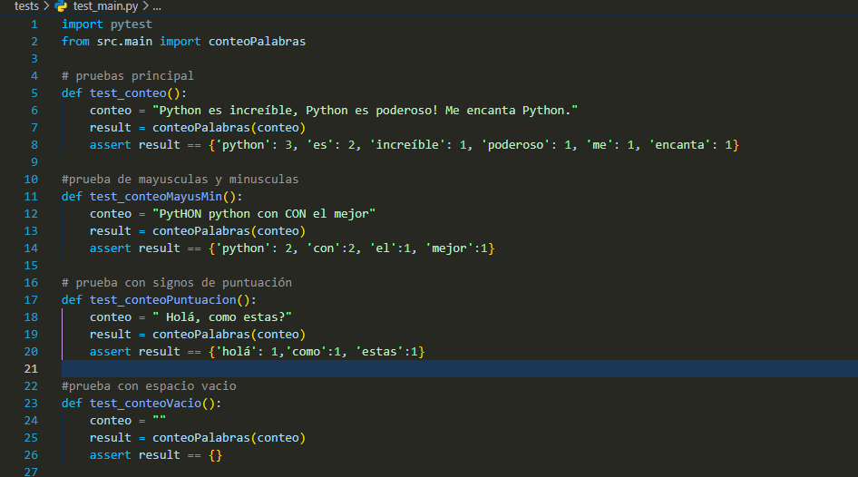
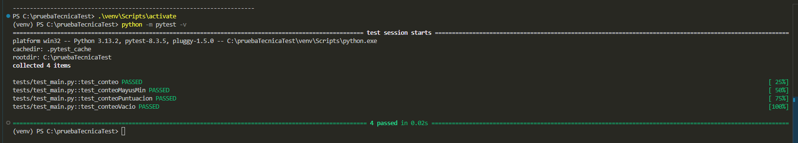

# Ejercicios prueba tecnica en python con pytest

Se realiza pruebas unitarias mediante pytest para verificar por medio de diferentes funciones para realizar diferentes verificaciones de la funcionalidad.


## Instalaciones recomendadas

Para el uso de este proyecto se recomiendo tener las siguentes isntalaciones

```bash
  pip install SQLALchemy
  pip isntall flask
  pip install pytest
```
    
## Pruebas de ejecución

Teniendo en cuenta la elaboración del ejercicio número dos para las pruebas técnicas, a este se le quiere realizar pruebas unitarias mediante pytet.

Se quiere evaluar las siguientes funciones: 



Su salida sería la siguiente:




